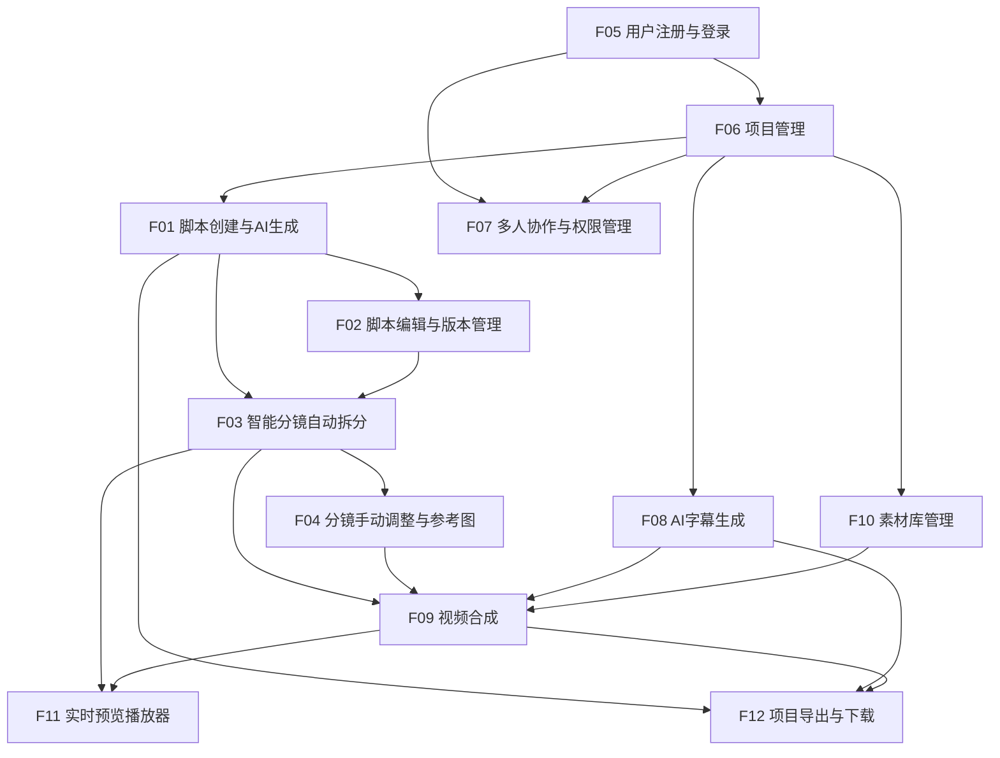

# 需求规格文档 — AI视频生成平台

## 1. 概述

### 项目背景
专业视频制作流程涉及脚本撰写、分镜设计、字幕制作、视频合成等多个环节，传统方式耗时长、协作成本高。AI视频生成平台旨在利用大语言模型、语音识别、图像生成等AI能力，将视频制作全流程智能化，大幅提升专业视频制作者的生产效率。

### 核心目标
- **MVP目标**：完整跑通"脚本生成 → 分镜制作 → 字幕生成 → 视频合成"主流程
- **目标用户**：专业视频制作者（广告创意团队、教程制作团队、短视频创作者）
- **核心价值**：AI驱动的全流程自动化 + 人工精细调控，兼顾效率与质量

### 技术栈约束
| 层级 | 技术选型 |
|------|----------|
| 前端 | Next.js + React |
| 后端 | FastAPI + PostgreSQL |
| 存储 | S3 兼容对象存储 |
| AI服务 | OpenAI（脚本/翻译）、Runway（画面生成）、ElevenLabs（语音合成）、Whisper（语音识别） |

---

## 2. 功能需求

### F01: 脚本创建与AI生成 (P0)
- **描述**: 用户选择视频类型（广告/教程/短视频），输入主题、关键词和风格偏好，系统调用AI生成完整视频脚本，包含场景描述、旁白文案、画面建议等结构化内容。
- **用户场景**: 广告策划师小李接到一个运动品牌推广需求，在平台选择"广告"类型，输入主题"夏季跑步鞋"、关键词"轻量、透气、活力"、风格"动感快节奏"，AI在10秒内生成包含3个场景的完整脚本，含旁白和画面建议。
- **验收标准**:
  1. 支持至少3种视频类型选择（广告/教程/短视频）
  2. 用户可输入主题（必填）、关键词（选填，逗号分隔）、风格偏好（选填，预设+自定义）
  3. AI生成脚本响应时间 ≤ 15秒
  4. 生成脚本包含：标题、场景列表、每场景含旁白文案和画面建议
  5. 生成失败时返回明确错误提示，支持一键重试
- **依赖**: F05（需登录后操作）
- **UI规格**:
  - 脚本创建页：视频类型选择卡片 → 主题输入框 → 关键词标签输入 → 风格下拉选择 → "生成脚本"按钮
  - 生成中显示loading动画和进度提示
  - 生成结果以结构化卡片形式展示，每个场景可折叠展开

### F02: 脚本编辑与版本管理 (P1)
- **描述**: 用户可在AI生成脚本基础上进行编辑修改，系统自动保存版本历史，支持版本对比和回滚。
- **用户场景**: 小李对AI生成的脚本第二场景旁白不满意，手动修改文案后保存。次日发现修改方向不对，通过版本对比查看差异，一键回滚到AI原始版本。
- **验收标准**:
  1. 支持对脚本所有字段（标题、场景、旁白、画面建议）的在线编辑
  2. 每次保存自动生成版本快照，版本号自增
  3. 支持任意两个版本的差异对比（高亮增删改内容）
  4. 支持一键回滚到任意历史版本
  5. 版本列表展示：版本号、保存时间、操作人、变更摘要
- **依赖**: F01
- **UI规格**:
  - 脚本编辑器：左侧场景导航 + 右侧富文本编辑区
  - 版本历史面板：时间轴形式展示版本列表，点击展开差异对比视图
  - 差异对比：左右分栏，增/删/改分别用绿/红/黄高亮

### F03: 智能分镜自动拆分 (P0)
- **描述**: 根据脚本内容自动拆分为分镜序列，每个分镜包含镜头编号、时长建议、画面描述和旁白对应片段，AI生成每个镜头的画面描述。
- **用户场景**: 小李完成脚本编辑后，点击"生成分镜"，系统根据脚本3个场景自动拆分为8个镜头，每个镜头标注建议时长和画面描述，小李可直接进入下一步制作。
- **验收标准**:
  1. 一键从脚本自动生成分镜序列
  2. 每个分镜包含：镜头编号、时长（秒）、画面描述、对应旁白片段
  3. AI生成的画面描述具体可执行（包含景别、主体动作、环境描述）
  4. 分镜生成响应时间 ≤ 20秒
  5. 分镜总时长与脚本预估时长偏差 ≤ 20%
- **依赖**: F01, F02
- **UI规格**:
  - 分镜生成按钮位于脚本编辑页顶部工具栏
  - 分镜以时间线形式横向排列，每个分镜为卡片，展示缩略图占位+画面描述+时长
  - 支持缩放时间线视图

### F04: 分镜手动调整与参考图 (P1)
- **描述**: 用户可手动调整分镜的顺序、时长，上传参考图片辅助画面生成，对AI画面描述进行修改。
- **用户场景**: 小李觉得第3和第4个镜头顺序应该互换，拖拽调整顺序；将第5个镜头时长从3秒延长到5秒；上传一张产品参考图到第1个镜头，作为AI生成画面的参考。
- **验收标准**:
  1. 支持拖拽调整分镜顺序
  2. 支持手动修改每个分镜的时长（最小0.5秒，最大60秒）
  3. 支持修改AI生成的画面描述文本
  4. 支持为每个分镜上传1张参考图片（JPG/PNG，≤5MB）
  5. 参考图片上传后显示缩略图预览
  6. 支持删除和新增分镜
- **依赖**: F03
- **UI规格**:
  - 分镜时间线支持拖拽排序（鼠标拖拽+触屏拖拽）
  - 点击分镜卡片展开编辑面板：时长滑块、画面描述文本框、参考图上传区
  - 参考图上传区：点击或拖拽上传，显示缩略图，支持替换和删除

### F05: 用户注册与登录 (P0)
- **描述**: 支持邮箱注册登录和社交账号（Google/GitHub）快捷登录，作为所有功能的前置条件。
- **用户场景**: 新用户小王首次访问平台，选择Google账号一键登录，系统自动创建账户并跳转到项目列表页。老用户小李通过邮箱+密码登录。
- **验收标准**:
  1. 支持邮箱+密码注册（密码强度校验：≥8位，含字母和数字）
  2. 支持邮箱+密码登录
  3. 支持Google OAuth登录
  4. 支持GitHub OAuth登录
  5. 注册后自动登录并跳转至项目列表
  6. 登录态JWT Token有效期24小时，支持自动刷新
  7. 登出清除本地Token
- **依赖**: 无
- **UI规格**:
  - 登录页：居中卡片式布局，邮箱/密码输入框 + 登录按钮，下方社交登录按钮（Google/GitHub图标），底部"注册"链接
  - 注册页：邮箱/密码/确认密码输入框 + 注册按钮，下方社交注册按钮
  - 顶部导航栏右侧：未登录显示"登录"按钮，已登录显示用户头像+下拉菜单（个人设置/登出）

### F06: 项目管理 (P0)
- **描述**: 用户可创建、查看、删除、归档视频项目，项目是脚本、分镜、字幕、视频等资源的容器。
- **用户场景**: 小李创建新项目"夏季跑鞋广告"，在项目中完成脚本和分镜制作。项目完成后归档，归档后不在活跃列表显示但可恢复。测试项目直接删除。
- **验收标准**:
  1. 创建项目：输入项目名称（必填，≤50字符）和描述（选填），选择视频类型
  2. 项目列表：展示用户所有项目，按更新时间倒序排列
  3. 支持项目搜索（按名称模糊匹配）
  4. 支持项目归档（归档后移入"已归档"标签页，可恢复）
  5. 支持项目删除（二次确认，删除后进入回收站保留7天）
  6. 项目卡片展示：名称、视频类型标签、更新时间、协作成员头像
- **依赖**: F05
- **UI规格**:
  - 项目列表页：顶部搜索框 + "新建项目"按钮，下方项目卡片网格
  - 项目卡片：缩略图/占位图 + 名称 + 类型标签 + 更新时间 + 成员头像
  - 卡片右键/三点菜单：归档、删除
  - 标签页切换：全部 / 活跃 / 已归档

### F07: 多人协作与权限管理 (P2)
- **描述**: 项目所有者可邀请其他用户加入项目，设置成员权限（所有者/编辑者/查看者），支持协作编辑。
- **用户场景**: 小李作为项目所有者，邀请同事小王加入"夏季跑鞋广告"项目，设置小王为编辑者权限。小王可以编辑脚本和分镜，但不能删除项目或邀请其他成员。
- **验收标准**:
  1. 支持通过邮箱邀请成员加入项目
  2. 支持三级权限：所有者（全部权限）、编辑者（编辑内容，不可管理成员和删除项目）、查看者（只读）
  3. 项目成员列表展示：头像、名称、角色、操作（移除/改角色）
  4. 被邀请者收到邮件通知，点击链接加入项目
  5. 所有者可转让角色
- **依赖**: F05, F06
- **UI规格**:
  - 项目设置页 → "成员"标签页
  - 成员列表：头像 + 名称 + 角色下拉选择 + 移除按钮
  - 邀请按钮：弹出对话框，输入邮箱 + 选择角色 → 发送邀请

### F08: AI字幕生成 (P0)
- **描述**: 用户上传音频文件，系统调用Whisper自动识别语音生成字幕，支持多语言翻译，支持字幕样式编辑和SRT/VTT格式导出。
- **用户场景**: 小李上传了一段30秒的旁白音频，系统自动识别为中文并生成时间轴字幕。小李将字幕翻译为英文，调整字体为白色黑体、底部居中，最后导出SRT文件用于视频合成。
- **验收标准**:
  1. 支持上传音频文件（MP3/WAV/M4A，≤100MB）
  2. 调用Whisper自动识别语音，生成带时间轴的字幕文本
  3. 字幕识别准确率 ≥ 90%（清晰普通话）
  4. 支持字幕文本的在线编辑和手动调整时间轴
  5. 支持多语言翻译（中文、英文、日文、韩文，调用OpenAI翻译API）
  6. 支持字幕样式编辑：字体、字号、颜色、位置（上/中/下）、背景色
  7. 支持导出SRT和VTT格式
  8. 音频识别处理时间 ≤ 音频时长的50%
- **依赖**: F05, F06
- **UI规格**:
  - 字幕编辑页：上方音频波形播放器 + 下方字幕时间轴编辑区
  - 字幕条目：时间码 + 文本编辑框，支持拖拽调整时间范围
  - 右侧面板：字幕样式设置（字体/颜色/位置等）+ 翻译按钮 + 导出按钮
  - 音频播放时当前字幕高亮

### F09: 视频合成 (P0)
- **描述**: 将视频片段、图片、音频、字幕等素材组合为完整视频，支持转场效果、背景音乐，支持多分辨率输出和实时预览。
- **用户场景**: 小李在分镜制作完成后，为每个分镜关联素材（视频片段/图片），添加背景音乐，选择"淡入淡出"转场效果，选择1080p输出，点击合成。系统在2分钟内生成视频，小李在线预览确认效果满意后下载。
- **验收标准**:
  1. 支持为每个分镜关联视频片段或图片素材
  2. 支持添加背景音乐（MP3/WAV，可设置音量和起止时间）
  3. 支持至少5种转场效果（淡入淡出、滑动、缩放、溶解、无转场）
  4. 支持叠加字幕（关联F08生成的字幕）
  5. 支持多分辨率输出：720p、1080p、4K
  6. 合成前支持实时预览（低分辨率快速预览）
  7. 合成进度实时展示（百分比+预估剩余时间）
  8. 合成完成后支持在线播放和下载
  9. 1080p/5分钟视频合成时间 ≤ 5分钟
- **依赖**: F03, F04, F08
- **UI规格**:
  - 合成编辑页：左侧素材库面板 + 中间时间线编辑器 + 右侧属性面板
  - 时间线：多轨道（视频轨、音频轨、字幕轨），支持拖拽排列
  - 属性面板：选中素材后显示可编辑属性（时长、转场、音量等）
  - 顶部工具栏：预览按钮 + 合成按钮 + 分辨率选择下拉
  - 合成进度弹窗：进度条 + 百分比 + 预估时间 + 取消按钮
  - 合成完成：自动播放预览 + 下载按钮

### F10: 素材库管理 (P1)
- **描述**: 用户可上传和管理视频、图片、音频等素材文件，素材可在项目内复用。
- **用户场景**: 小李上传了10张产品图片和2段背景音乐到项目素材库，在分镜制作和视频合成时直接从素材库选择使用，无需重复上传。
- **验收标准**:
  1. 支持上传素材：图片（JPG/PNG/WebP，≤10MB）、视频（MP4/MOV，≤500MB）、音频（MP3/WAV，≤100MB）
  2. 素材列表展示：缩略图、文件名、类型标签、大小、上传时间
  3. 支持按类型筛选（全部/图片/视频/音频）
  4. 支持素材删除（二次确认）
  5. 上传进度条实时展示
  6. 素材存储在S3兼容对象存储中
- **依赖**: F05, F06
- **UI规格**:
  - 素材库页面：顶部上传按钮 + 类型筛选标签 + 搜索框
  - 素材网格/列表视图切换
  - 上传区域：拖拽上传 + 点击上传，支持批量上传
  - 素材卡片：缩略图 + 文件名 + 类型标签 + 大小 + 操作菜单（预览/删除）

### F11: 实时预览播放器 (P1)
- **描述**: 在分镜编辑和视频合成阶段提供实时预览能力，用户可快速查看当前编辑效果，无需等待完整合成。
- **用户场景**: 小李在调整分镜顺序后，点击预览按钮快速查看低分辨率预览，确认画面切换节奏是否合适，再进行正式合成。
- **验收标准**:
  1. 分镜编辑页支持"快速预览"，以幻灯片形式按分镜顺序播放画面描述+参考图
  2. 视频合成页支持低分辨率实时预览
  3. 预览播放器支持：播放/暂停、进度拖拽、音量控制
  4. 预览加载时间 ≤ 3秒
  5. 预览不生成持久化文件，仅临时渲染
- **依赖**: F03, F09
- **UI规格**:
  - 预览播放器：居中浮层或右侧面板
  - 播放控制栏：播放/暂停按钮 + 进度条 + 时间显示 + 音量滑块
  - 分镜预览：参考图/占位图 + 画面描述文字叠加

### F12: 项目导出与下载 (P1)
- **描述**: 支持将项目成果（视频文件、字幕文件、脚本文档）打包导出下载。
- **用户场景**: 小李完成视频制作后，需要将1080p视频、中英文字幕SRT文件和脚本PDF一起下载交付给客户。
- **验收标准**:
  1. 支持单独下载视频文件（MP4格式）
  2. 支持单独下载字幕文件（SRT/VTT格式）
  3. 支持导出脚本为PDF格式
  4. 支持一键打包下载所有项目产出物（ZIP格式）
  5. 下载链接有效期24小时
- **依赖**: F01, F08, F09
- **UI规格**:
  - 项目详情页 → "导出"按钮 → 下拉菜单：下载视频 / 下载字幕 / 导出脚本PDF / 打包下载全部

---

## 3. 非功能需求

### 3.1 性能
| 指标 | 目标值 |
|------|--------|
| 页面首屏加载时间 | ≤ 2秒 |
| AI脚本生成响应时间 | ≤ 15秒 |
| 音频识别处理时间 | ≤ 音频时长的50% |
| 1080p/5分钟视频合成时间 | ≤ 5分钟 |
| 预览加载时间 | ≤ 3秒 |
| API平均响应时间（非AI调用） | ≤ 500ms |

### 3.2 可用性
- 系统可用性 ≥ 99.5%（月度）
- AI服务降级时，核心编辑功能不受影响
- 文件上传支持断点续传（≥10MB的文件）

### 3.3 安全
- 用户密码bcrypt加密存储
- JWT Token认证，24小时过期+自动刷新
- 文件上传类型和大小校验（服务端）
- API接口限流：普通用户100次/分钟，AI接口10次/分钟
- 用户数据隔离：项目数据仅成员可访问

### 3.4 可扩展性
- AI服务抽象为统一接口，支持后续替换/新增AI供应商
- 视频类型可扩展（新增类型无需改动核心逻辑）
- 存储层抽象，支持切换S3兼容的不同供应商

### 3.5 兼容性
- 前端支持：Chrome 90+、Firefox 90+、Safari 15+、Edge 90+
- 移动端响应式适配（查看和基础编辑，完整编辑需桌面端）

---

## 4. 优先级分布

| 优先级 | 功能数 | 功能列表 |
|--------|--------|----------|
| P0 | 5 | F01 脚本创建与AI生成, F03 智能分镜自动拆分, F05 用户注册与登录, F06 项目管理, F08 AI字幕生成, F09 视频合成 |
| P1 | 5 | F02 脚本编辑与版本管理, F04 分镜手动调整与参考图, F10 素材库管理, F11 实时预览播放器, F12 项目导出与下载 |
| P2 | 1 | F07 多人协作与权限管理 |
| P3 | 0 | — |

> **MVP范围（P0）**: F05 → F06 → F01 → F03 → F08 → F09，完整跑通主流程

---

## 5. 依赖关系图

### 推荐开发顺序（按依赖拓扑排序）
1. **F05** 用户注册与登录 — 无依赖，基础设施
2. **F06** 项目管理 — 依赖F05，数据容器
3. **F01** 脚本创建与AI生成 — 依赖F05/F06，主流程起点
4. **F02** 脚本编辑与版本管理 — 依赖F01
5. **F03** 智能分镜自动拆分 — 依赖F01/F02
6. **F08** AI字幕生成 — 依赖F05/F06，可与F01-F03并行
7. **F04** 分镜手动调整与参考图 — 依赖F03
8. **F10** 素材库管理 — 依赖F05/F06，可与F03-F04并行
9. **F09** 视频合成 — 依赖F03/F04/F08/F10，主流程终点
10. **F11** 实时预览播放器 — 依赖F03/F09
11. **F12** 项目导出与下载 — 依赖F01/F08/F09
12. **F07** 多人协作与权限管理 — 依赖F05/F06，P2可后置

---

## 6. 术语表

| 术语 | 定义 |
|------|------|
| 脚本 | 视频的文字蓝图，包含场景、旁白、画面建议 |
| 分镜 | 将脚本拆分为可执行的镜头序列，每个镜头对应一段画面 |
| 时间轴 | 以时间为横轴展示素材排列的编辑界面 |
| 转场 | 两个镜头之间的过渡效果 |
| SRT | SubRip字幕格式，通用字幕文件格式 |
| VTT | WebVTT字幕格式，Web标准字幕格式 |
